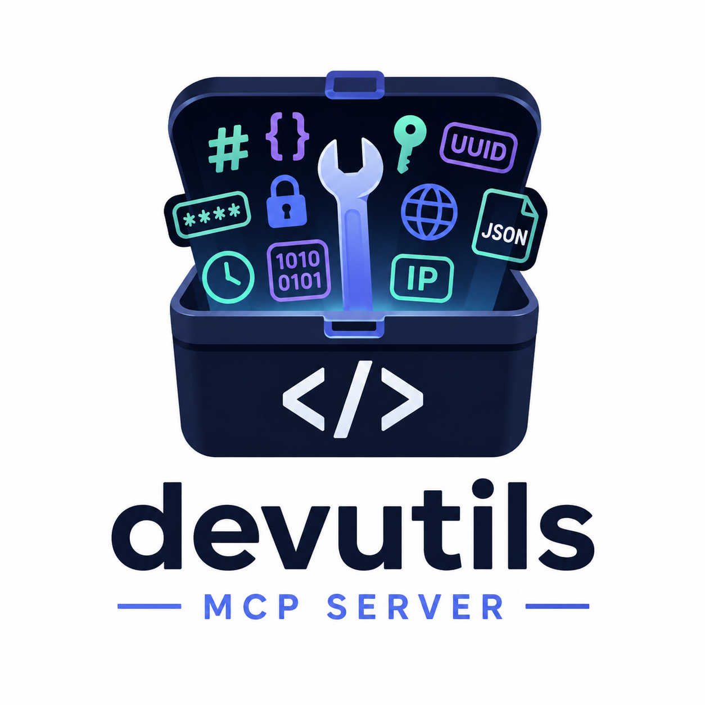

# DevUtils MCP Plugin

> One-click install for [devutils-mcp-server](https://github.com/paladini/devutils-mcp-server) — **36 local developer utilities** (hash, encoding, UUID, JWT, JSON, network, text) with zero API keys.

[](https://opensource.org/licenses/MIT)
[](https://modelcontextprotocol.io)
[](https://www.npmjs.com/package/devutils-mcp-server)
[](https://registry.modelcontextprotocol.io)
[](https://github.com/paladini/devutils-cursor-plugin/stargazers)

<p align="center">
  
</p>

Works with **Cursor** and **Claude Code**. A single `mcp.json` runs `npx -y devutils-mcp-server` locally.

## Install

### Cursor (recommended)

1. Open **Cursor Settings → Customize**
2. Search for **DevUtils MCP**
3. Click **Install**
4. Enable the **devutils** MCP server under **Customize → MCPs**

Or install from this repo: **Customize → Add from GitHub** → `paladini/devutils-cursor-plugin`

### Claude Code

```text
/plugin marketplace add paladini/devutils-cursor-plugin
/plugin install devutils-mcp@devutils-cursor-plugin
```

### Any other MCP client

Use the server directly — no plugin required:

```bash
npx -y devutils-mcp-server
```

See [devutils-mcp-server setup](https://github.com/paladini/devutils-mcp-server#-client-setup) for Claude Desktop, VS Code, Windsurf, and Docker.

## Usage

Ask your agent to use DevUtils tools:

- "Generate a UUID v4"
- "Decode this JWT and check if it's expired"
- "Hash this string with SHA-256"
- "Pretty-print this JSON and validate it"
- "What hosts are in 10.0.0.0/24?"

Full tool list: [devutils-mcp-server README](https://github.com/paladini/devutils-mcp-server#-available-tools-36-total)

## Available on

| Channel | Link |
| --- | --- |
| **Official MCP Registry** | `io.github.paladini/devutils-mcp-server` — [registry.modelcontextprotocol.io](https://registry.modelcontextprotocol.io) |
| **npm** | [devutils-mcp-server](https://www.npmjs.com/package/devutils-mcp-server) |
| **Glama** | [glama.ai/mcp/servers/paladini/devutils-mcp-server](https://glama.ai/mcp/servers/paladini/devutils-mcp-server) |
| **Smithery** | [smithery.ai/server/devutils-mcp-server](https://smithery.ai/server/devutils-mcp-server) |
| **Cursor Marketplace** | Submitted — search **DevUtils MCP** in Customize |
| **cursor.directory** | Submitted |

## Requirements

- [Cursor](https://cursor.com) or [Claude Code](https://claude.com/product/claude-code) with MCP/plugin support
- [Node.js](https://nodejs.org/) 18+

## Privacy

This plugin runs tools **locally on your machine**. No data is sent to the plugin author. See [PRIVACY.md](PRIVACY.md).

## Contributing

Bug reports and plugin issues: [GitHub Issues](https://github.com/paladini/devutils-cursor-plugin/issues)

Questions and ideas: [GitHub Discussions](https://github.com/paladini/devutils-cursor-plugin/discussions)

New tools or server changes: contribute to [devutils-mcp-server](https://github.com/paladini/devutils-mcp-server). See [CONTRIBUTING.md](CONTRIBUTING.md).

## Related

| Repo | Role |
| --- | --- |
| [devutils-mcp-server](https://github.com/paladini/devutils-mcp-server) | MCP server — 36 tools, npm package, Docker |
| [devutils-cursor-plugin](https://github.com/paladini/devutils-cursor-plugin) | This repo — Cursor + Claude plugin wrapper |

## License

MIT — see [LICENSE](LICENSE).
